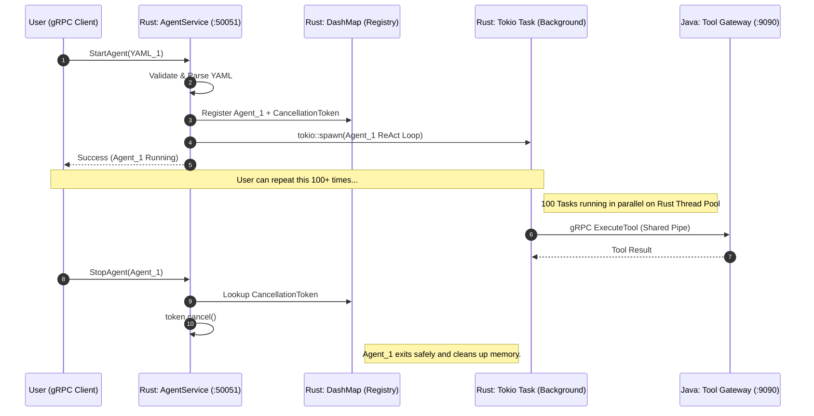

# AgentKube: Kubernetes for AI Agents

AgentKube is an open-source, high-performance agent runtime platform. It treats AI agents as managed processes, providing the infrastructure for execution, tool discovery, memory management, and inter-agent communication.

## The Core Philosophy: Infrastructure vs. Frameworks
Most agent projects are built as libraries (like LangChain) where the developer hardcodes the execution logic. AgentKube is built as **Platform Infrastructure**. 

You define an agent in YAML; the platform handles the rest.

---

## 1. High-Performance Execution Engine (Rust)
The "Brain" of the system. A Rust-based gRPC server built on the `tokio` async runtime.

### Multi-Agent Concurrency Model
The engine is designed to handle hundreds of parallel agent processes on a single node without blocking.



### Key Technical Patterns:
*   **Green Threading**: Uses `tokio::spawn` to run agents in isolated background tasks.
*   **Lock-Free Registry**: Uses `DashMap` to track thousands of active agents with zero contention overhead.
*   **Graceful Termination**: Uses `CancellationToken` to "ask" agents to quit, ensuring file handles and sockets are closed properly.
*   **Resource Sharing**: Uses `Arc` (Atomically Reference Counted) pointers to share a single gRPC connection pool across all running agents.

---

## 2. Tool Gateway Service (Java)
The "Hands" of the system. A Spring Boot application that validates and executes agent actions.

*   **gRPC Boundary**: Receives binary tool requests from the Rust engine.
*   **Jackson 3 Pipeline**: High-speed JSON parsing into AST (Abstract Syntax Tree).
*   **JSON Schema Validation**: Uses `networknt` to verify agent inputs against strict contracts before execution, preventing LLM hallucinations from causing system errors.

---

## 3. Getting Started

### Local Development Environment
The platform runs as a set of microservices.

1. **Start the Java Tool Gateway**:
   ```bash
   cd gateway
   mvn spring-boot:run
   ```

2. **Start the Rust Execution Engine**:
   ```bash
   cd engine
   cargo run
   ```

3. **Deploy an Agent** (Coming Soon via `agentctl`):
   ```bash
   # Placeholder for future CLI
   agentctl apply -f examples/agents/researcher.yaml
   ```

---

## Documentation
*   [**System Atlas**](docs/SYSTEM_ATLAS.md): Deep-dive technical mapping of every file and data flow.
*   [**Build Plan**](docs/BUILD_PLAN.md): The 16-week roadmap and architectural reasoning.
*   [**Progress Tracker**](PROGRESS.md): Current status of Phase 1 and 2.
