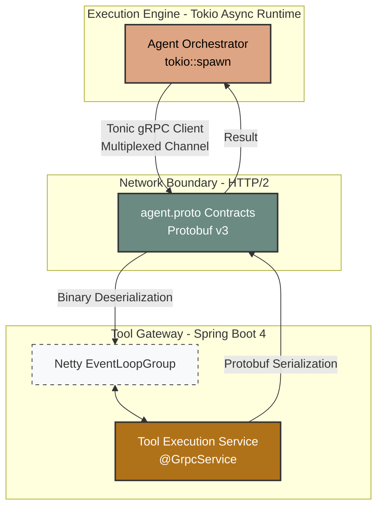
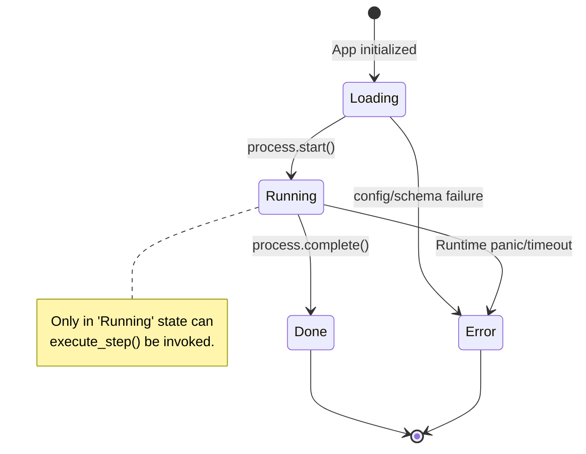
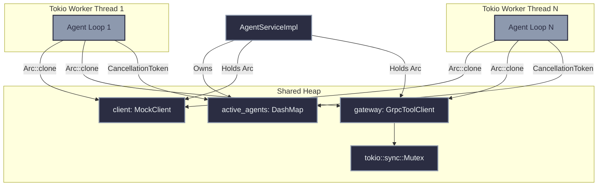
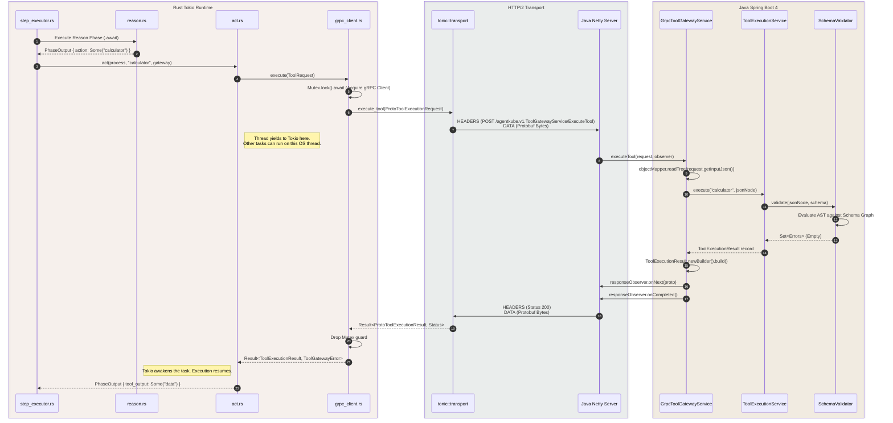

# AgentKube System Atlas: The Complete Architecture

This document is the absolute ground truth for the AgentKube project. It maps the exact technical implementation, file-by-file data flows, memory models, and concurrency architectures of the system. 

No analogies. Just raw technical truth, structured for absolute clarity.

---

## 1. System Topology Overview

The system operates as two distinct processes communicating over a binary RPC protocol (gRPC) using HTTP/2 framing.



---

## 2. The Shared Contract (Protobuf)

### `proto/agent.proto`
The absolute source of truth for cross-process communication. 
- **`AgentService`**: Defines `StartAgent`, `StopAgent`, and `StreamAgent`. (Implemented in Rust).
- **`ToolGatewayService`**: Defines `ExecuteTool`. (Implemented in Java).
- **Data Structures**: 
  - `ToolExecutionRequest`: Contains `agent_id` (string), `tool_name` (string), `input_json` (string).
  - `ToolExecutionResult`: Contains `success` (bool), `output` (string), `errors` (repeated string).
- **Compilation Mechanics**: 
  - **Rust**: Uses `tonic-build` in `engine/build.rs`. Translates `rpc` definitions into `async` traits and generates `prost` structs for serialization.
  - **Java**: Uses `protobuf-maven-plugin` attached to the `compile` phase. Evaluates `option java_multiple_files = true` to generate granular `.java` classes, preventing monolithic file bloat.

---

## 3. The Rust Execution Engine: Architecture & Concurrency

The Rust engine utilizes the `tokio` runtime to manage thousands of lightweight tasks over a small thread pool. It enforces strict state machine transitions and relies on `Arc` (Atomically Reference Counted) pointers to share I/O resources safely across thread boundaries.

### 3.1 Core Agent State Machine

Agents operate within a rigid Finite State Machine defined in `engine/src/process/state.rs`.



### 3.2 Memory & Concurrency Model



### 3.3 File-by-File Breakdown: Rust

#### Core & Process (`engine/src/process/`)
- **`app.rs`**: The high-level file loader. Maps YAML to `AgentProcess`. Instantiates `CancellationToken` and invokes `run_agent_loop`.
- **`state.rs`**: Implements the `AgentState` enum and transition logic. Enforces mutability rules preventing execution outside the `Running` state.
- **`agent.rs`**: Encapsulates `AgentConfig` and `AgentState`. Acts as the mutable context passed through the loop.

#### Execution Runtime (`engine/src/runtime/execution/`)
- **`service.rs`**: Implements `AgentService` via `#[tonic::async_trait]`. 
  - Uses `DashMap<String, CancellationToken>` for lock-free concurrent map operations, enabling O(1) agent termination via `stop_agent`.
  - Distributes `Arc<MockClient>` and `Arc<GrpcToolClient>` to `tokio::spawn` closures to satisfy `'static` lifetime bounds without deep copying connections.
- **`loop_runner.rs`**: Orchestrates `spawn_agent_loop` and `run_agent_loop`. Uses a `tokio::select!` macro to race the execution loop against `token.cancelled()`, ensuring immediate teardown upon `StopAgent` requests.
- **`step_executor.rs`**: Awaits `perceive()`, `reason()`, and `act()` sequentially. Aggregates the resulting `PhaseOutput` structs into a `StepRecord`.

#### The ReAct Phases (`engine/src/runtime/phases/`)
- **`output.rs`**: Defines `PhaseOutput`. Employs specialized constructors to enforce invariants:
  - `new()`: Perceive phase. `action` = None, `tool_output` = None.
  - `with_action()`: Reason phase. `action` = Some, `tool_output` = None.
  - `with_tool_output()`: Act phase. `action` = None, `tool_output` = Some.
- **`reason.rs`**: Interfaces with the LLM via `AgentClient` trait. Extracts the target tool.
- **`act.rs`**: Resolves `action: Option<String>`. If `None`, halts execution. If `Some`, builds `ToolRequest`, `.await`s the `ToolGateway`, and handles `Result<ToolExecutionResult, ToolGatewayError>`.

#### Tool Boundary (`engine/src/runtime/tool/`)
- **`gateway.rs`**: Exposes `async trait ToolGateway : Send + Sync`.
- **`grpc_client.rs`**: Manages `ToolGatewayServiceClient<tonic::transport::Channel>`. The `Channel` is internally multiplexed by HTTP/2, but the client struct is guarded by `tokio::sync::Mutex` to satisfy `&self` mutability constraints during the `.await` execution.
- **`error.rs`**: Leverages the `thiserror` proc-macro. Expands `#[error("Execution failed: {0}")]` into a formal `std::fmt::Display` implementation, enabling zero-overhead formatting in `act.rs` error paths.

---

## 4. The Java Tool Gateway: Execution Pipeline

The Java Gateway uses Spring Boot 4 running Netty. It exposes a reactive, non-blocking gRPC listener that bridges binary payloads into the Jackson 3 processing pipeline.

```mermaid
flowchart TD
    classDef spring fill:#6db33f,stroke:#2b2d42,stroke-width:2px,color:#fff
    classDef svc fill:#fff,stroke:#6db33f,stroke-width:2px,color:#333
    classDef jackson fill:#00a8e8,stroke:#007ea7,stroke-width:2px,color:#fff

    Request[Protobuf Bytes\nvia Netty]:::spring --> GrpcService[`GrpcToolGatewayService`\n@GrpcService]:::svc
    
    subgraph JSON Parsing Pipeline
        GrpcService -- "readTree(inputJson)" --> Parser[Jackson 3 ObjectMapper]:::jackson
        Parser -. "throws" .-> Err[JacksonException]:::jackson
        Parser -- "returns" --> Node[JsonNode AST]:::jackson
    end
    
    subgraph Validation Pipeline
        Node --> ToolExec[`ToolExecutionService`]:::svc
        ToolExec -- "Fetches Schema" --> Registry[`ToolRegistryService`]:::svc
        ToolExec -- "Validates AST" --> Validator[`SchemaValidator`\nnetworknt v3]:::svc
    end
    
    Validator -- "Set<ValidationErrors>" --> ToolExec
    ToolExec -- "Maps to Record" --> GrpcService
    GrpcService -- "Builds Proto Message\nonNext() & onCompleted()" --> Response[Response Bytes\nvia Netty]:::spring
```

### 4.1 File-by-File Breakdown: Java

#### Build & Infrastructure
- **`pom.xml`**: 
  - `grpc-server-spring-boot-starter`: Scans the classpath for `@GrpcService` and binds them to the Netty server lifecycle. Defaults to port 9090.
  - `os-maven-plugin`: Resolves `${os.detected.classifier}` (e.g., `linux-x86_64`) to fetch the correct native `protoc` binary.
  - `protobuf-maven-plugin`: Hooks into the `compile` lifecycle to generate Java stubs before `javac` processes the main source tree.

#### gRPC Layer
- **`grpc/server/GrpcToolGatewayService.java`**: 
  - Extends the generated `ToolGatewayServiceImplBase`.
  - Implements `executeTool(request, responseObserver)`.
  - Handles Jackson 3 `JacksonException` specifically, isolating parsing errors from downstream execution logic and ensuring a structured `ToolExecutionResult` with `success=false` is returned over the `StreamObserver` instead of terminating the HTTP/2 stream with an unhandled exception.

#### Execution Layer
- **`service/ToolExecutionService.java`**: The routing controller. Retrieves the `ToolDefinition` from the registry. If found, passes the schema and the `JsonNode` to the validator.
- **`service/ToolRegistryService.java`**: Maintains an in-memory `List<ToolDefinition>`. Currently hardcodes a `calculator` definition containing a raw JSON schema string.
- **`validation/SchemaValidator.java`**: 
  - Utilizes `com.networknt.schema` v3.0.x (Jackson 3 compatible).
  - Instantiates a `SchemaRegistry` to compile the raw JSON schema into an executable validation graph.
  - Traverses the incoming `JsonNode` against the schema graph, returning a `Set<String>` detailing structural violations (e.g., missing required fields, type mismatches).

---

## 5. End-to-End Sequence: A Tool Call (Deep Dive)

This sequence exposes the synchronous points, the await boundaries, and data transformations.



## 6. Error Propagation Mechanics

Errors at different layers are handled deterministically to prevent systemic crashes:
1.  **JSON Malformation (Java)**: Caught by `JacksonException` in `GrpcToolGatewayService`. Returns `success=false` with specific parsing errors inside the `ToolExecutionResult` proto. Rust interprets this as a successful network call that resulted in a tool failure.
2.  **Schema Violation (Java)**: Caught by `SchemaValidator`. Returns `success=false` with structural errors. Handled identically to JSON malformation.
3.  **Network Failure/Timeout (Rust/Java)**: `tonic::transport` detects socket closure or HTTP/2 stream RST. Returns a `tonic::Status` error to `GrpcToolClient`.
4.  **Client Mapping (Rust)**: `GrpcToolClient` converts `tonic::Status` into `ToolGatewayError::ExecutionFailed`.
5.  **Phase Logging (Rust)**: `act.rs` matches on `Err(err)` and embeds the stringified `ToolGatewayError` into the `PhaseOutput.tool_output` using a distinct `ERROR_GATEWAY_UNREACHABLE` tag, ensuring the LLM context is informed of the infrastructure failure.
