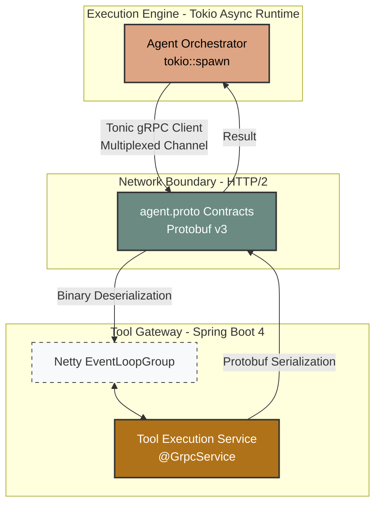
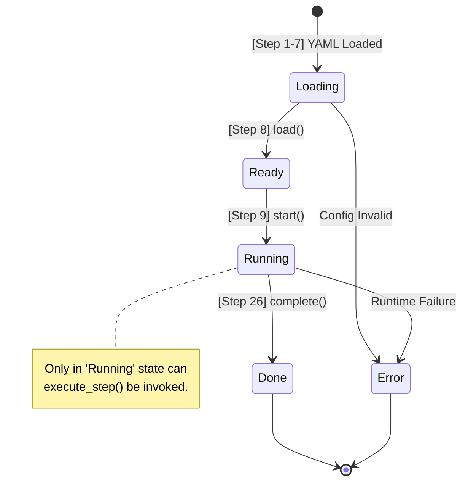
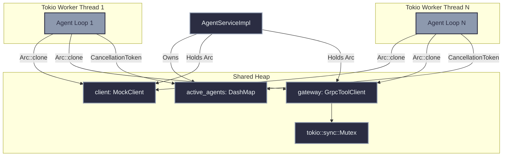
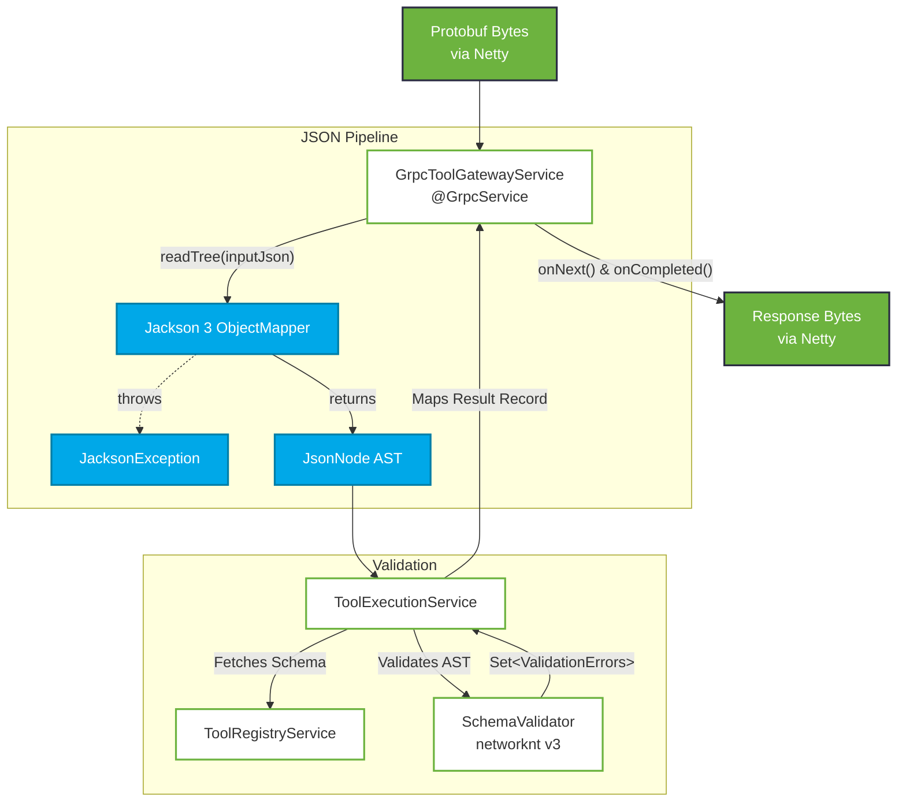
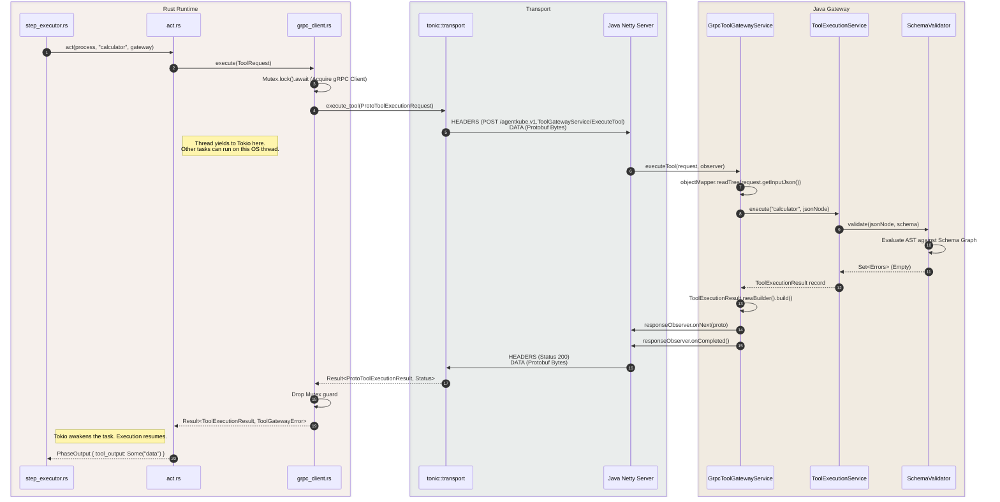

# AgentKube System Atlas: The Complete Architecture

This document is the absolute ground truth for the AgentKube project. It maps the exact technical implementation, file-by-file data flows, memory models, and concurrency architectures of the system. 

No analogies. Just raw technical truth, structured for absolute clarity.

---

## 1. System Topology Overview

The system operates as two distinct processes communicating over a binary RPC protocol (gRPC) using HTTP/2 framing.

---

## 2. Chronological Lifecycle: The 26-Step Execution Path

This is the exact sequence of events from the moment a YAML file is submitted until the agent task completes.

### Phase A: Configuration & Process Creation (Rust)
1.  **`main.rs`**: Bootstraps the Tokio multi-threaded runtime and initializes the `AgentServiceImpl` gRPC server.
2.  **`app.rs`**: `run_agent_file()` receives a filesystem path to an agent YAML (e.g., `researcher.yaml`).
3.  **`loader.rs`**: `load_agent_config_from_file()` reads the raw bytes from the disk into a `String`.
4.  **`parser.rs`**: `parse_agent_config()` uses `serde_yaml` to map the string into a structured `AgentConfig`.
5.  **`validation.rs`**: `validate_agent_config()` enforces business rules (e.g., name cannot be empty, step budget must be > 0). Returns `ConfigError` if validation fails.
6.  **`model.rs`**: Provides the structural definition for `AgentConfig` using `serde` derive macros for automated mapping.
7.  **`agent.rs`**: `AgentProcess::from_config()` is called, creating the process object in the **`Loading`** state.
8.  **`startup.rs`**: `load()` is called, triggering a transition from `Loading` to **`Ready`**.
9.  **`startup.rs`**: `start()` is called, moving the state from `Ready` to **`Running`**, enabling resource consumption.

### Phase B: Orchestration & Concurrency (Rust)
10. **`service.rs`**: Implements the `AgentService` gRPC server. It instantiates the `CancellationToken` for task isolation.
11. **`loop_runner.rs`**: `spawn_agent_loop()` creates a brand new `tokio` thread task (Green Thread) to isolate this agent from others.
12. **`loop_runner.rs`**: `run_agent_loop()` begins. It creates a bounded loop that will run for exactly `max_steps`.
13. **`loop_runner.rs`**: Checks the `CancellationToken` via `token.is_cancelled()` at the start of every iteration for O(1) shutdown.

### Phase C: The ReAct Execution Loop (Rust)
14. **`step_executor.rs`**: `execute_step()` is called to coordinate the three sub-phases of a single ReAct step.
15. **`perceive.rs`**: Gathers system logs, environment variables, and memory context. Returns a `PhaseOutput`.
16. **`reason.rs`**: Interfaces with the `AgentClient` (LLM). Parses the prompt response and returns the target tool choice.
17. **`act.rs`**: Resolves `action: Option<String>`. If `Some`, it constructs a binary `ToolRequest` with a placeholder JSON input.
18. **`grpc_client.rs`**: Acquires a `Mutex` lock on the tonic channel to satisfy mutability requirements and fires the request over HTTP/2.

### Phase D: Tool Execution & Validation (Java)
19. **Java Netty**: Receives the binary blob and routes it to the `ExecuteTool` RPC implementation based on the Protobuf method descriptor.
20. **`GrpcToolGatewayService.java`**: Receives the request and extracts the `input_json` string.
21. **Jackson 3**: `objectMapper.readTree()` converts the raw string into a structured `JsonNode` (the AST).
22. **`ToolExecutionService.java`**: Receives the `JsonNode` and coordinates the routing between the registry and validator.
23. **`ToolRegistryService.java`**: Looks up the tool definition and retrieves the specific JSON Schema for the "calculator".
24. **`SchemaValidator.java`**: Compiles the schema into an executable graph and traverses the `JsonNode` AST for validation errors.
25. **`GrpcToolGatewayService.java`**: Maps the internal result record into a `ToolExecutionResult` Protobuf message and sends it back to Rust.

### Phase E: Response & Termination (Rust)
26. **`termination.rs`**: Once the loop budget is exhausted or a final answer is reached, `complete()` is called, moving the agent to **`Done`** and freeing the Tokio task.

---

## 3. The Shared Contract (Protobuf)

### `proto/agent.proto`
The absolute source of truth for cross-process communication. 
- **`AgentService`**: Defines `StartAgent`, `StopAgent`, and `StreamAgent`. (Implemented in Rust).
- **`ToolGatewayService`**: Defines `ExecuteTool`. (Implemented in Java).
- **Data Structures**: 
  - `ToolExecutionRequest`: Contains `agent_id` (string), `tool_name` (string), `input_json` (string).
  - `ToolExecutionResult`: Contains `success` (bool), `output` (string), `errors` (repeated string).
- **Compilation Mechanics**: 
  - **Rust**: Uses `tonic-build` in `engine/build.rs`. Translates `rpc` definitions into `async` traits and generates `prost` structs for serialization.
  - **Java**: Uses `protobuf-maven-plugin` attached to the `compile` phase. Evaluates `option java_multiple_files = true` to generate granular `.java` classes, preventing monolithic file bloat.

---

## 4. The Rust Execution Engine: Architecture

### 4.1 Core Agent State Machine
Defined in `engine/src/process/state.rs`.

### 4.2 Memory & Concurrency Model

### 4.3 Detailed File Responsibilities: Rust

#### Core & Process (`engine/src/process/`)
- **`app.rs`**: Entrypoint for file-based runs. Triggers the 26-step path by mapping YAML to the `AgentProcess` and initiating the Tokio loop spawner.
- **`state.rs`**: Implements the `AgentState` enum and `is_valid_transition` logic. Acts as the system-wide guard for lifecycle movement.
- **`agent.rs`**: The primary data structure. Encapsulates `AgentConfig` and `AgentState`. Config is immutable; State is mutable via transition logic.
- **`lifecycle/*`**: Logic for `startup.rs` (load/start) and `termination.rs` (complete/fail), and `control.rs` (pause/resume).

#### Execution Runtime (`engine/src/runtime/execution/`)
- **`service.rs`**: Implements `AgentService` gRPC server via `#[tonic::async_trait]`. 
  - Uses `DashMap<String, CancellationToken>` for lock-free concurrent map operations, enabling O(1) agent termination.
  - Distributes `Arc<MockClient>` and `Arc<GrpcToolClient>` to `tokio::spawn` tasks to satisfy `'static` lifetime bounds without cloning underlying connections.
- **`loop_runner.rs`**: Manages the life of the agent task. Uses a `tokio::select!` macro to race the loop against `token.cancelled()`, ensuring zero-latency teardown.
- **`step_executor.rs`**: The conductor of the ReAct cycle. Sequentially awaits `perceive()`, `reason()`, and `act()`, bundling their outputs into a `StepRecord`.

#### ReAct Phases (`engine/src/runtime/phases/`)
- **`output.rs`**: Defines `PhaseOutput`. Employs specialized constructors (`new`, `with_action`, `with_tool_output`) to enforce data tracking integrity. Uses `Option<String>` to differentiate between no tool run (`None`), empty result (`Some("")`), and actual data.
- **`reason.rs`**: Interacts with `AgentClient`. Generates logs like `thought: ... (via gemini-flash)`.
- **`act.rs`**: The network orchestrator. Builds the `ToolRequest`, calls the gateway, and maps network errors into the `PhaseOutput`.

#### Tool Boundary (`engine/src/runtime/tool/`)
- **`gateway.rs`**: Exposes the `async trait ToolGateway`.
- **`grpc_client.rs`**: Concrete implementation using `tonic`. Connects to port 9090, maps Rust structs to Protobuf messages, and uses `tokio::sync::Mutex` for thread-safe channel access.
- **`error.rs`**: Leverages `thiserror` proc-macros to expand `#[error(...)]` tags into `Display` implementations for gRPC failures.

---

## 5. The Java Tool Gateway: Execution Pipeline

The Java Gateway utilizes Spring Boot 4 and Jackson 3 to process tool requests with sub-millisecond overhead.

### 5.1 Detailed File Responsibilities: Java

#### Build & Infrastructure
- **`pom.xml`**: Manages the `grpc-server-spring-boot-starter` for Netty auto-configuration and `protobuf-maven-plugin` for Java class generation from `agent.proto`.
- **`GatewayApplication.java`**: Standard entrypoint; triggers component scanning for `@GrpcService` and `@Component`.

#### gRPC Layer
- **`GrpcToolGatewayService.java`**: Bridge between Network and Service. 
  - Overrides `executeTool(request, responseObserver)`.
  - Specifically catches `JacksonException` for invalid JSON, returning `success=false` to Rust instead of terminating the stream.

#### Execution & Validation
- **`ToolExecutionService.java`**: The routing brain. Orchestrates the registry and validator.
- **`ToolRegistryService.java`**: Maintains `List<ToolDefinition>`. Contains hardcoded JSON schemas for registered tools.
- **`SchemaValidator.java`**: Compiles raw JSON Schema strings into a validation graph using `com.networknt.schema` v3.0.x. Performs recursive AST traversal against the incoming `JsonNode`.

---

## 6. End-to-End Sequence: A Tool Call (Deep Dive)

This sequence traces the synchronous points, the await boundaries, and data transformations.

---

## 7. Error Propagation Mechanics

Errors at different layers are handled deterministically:
1.  **JSON Malformation (Java)**: Caught by `JacksonException` in `GrpcToolGatewayService`. Returns `success=false` with specific parsing errors inside the `ToolExecutionResult` proto. Rust interprets this as a successful network call that resulted in a tool failure.
2.  **Schema Violation (Java)**: Caught by `SchemaValidator`. Returns `success=false` with structural errors. Handled identically to JSON malformation.
3.  **Network Failure/Timeout (Boundary)**: `tonic::transport` detects socket closure or HTTP/2 stream RST. Returns a `tonic::Status` error to `GrpcToolClient`.
4.  **Client Mapping (Rust)**: `GrpcToolClient` converts `tonic::Status` into `ToolGatewayError::ExecutionFailed`.
5.  **Phase Logging (Rust)**: `act.rs` matches on `Err(err)` and embeds the stringified `ToolGatewayError` into the `PhaseOutput.tool_output` using a distinct `ERROR_GATEWAY_UNREACHABLE` tag, ensuring the LLM context is informed of the infrastructure failure.
