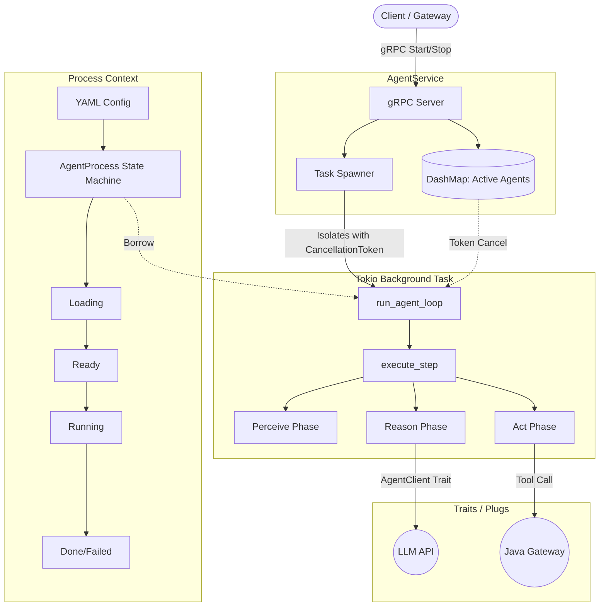

# ADR 0002: Agent Execution Engine Architecture

## Context
We need a highly concurrent, state-machine driven engine in Rust to execute agents. The engine must support plugging in different LLMs, isolating tasks, and communicating over gRPC.

## Architecture Diagram

## Decisions
1. **Tokio Isolation**: We use `tokio::spawn` and `CancellationToken` to run agents concurrently. If an agent goes rogue or the user calls `StopAgent`, we cancel the token and the loop exits immediately.
2. **State Machine**: The `AgentProcess` enforces valid transitions (e.g., cannot `start` if not `Ready`).
3. **Traited Client**: The `AgentClient` trait abstracts the LLM, allowing us to swap providers without touching core logic.